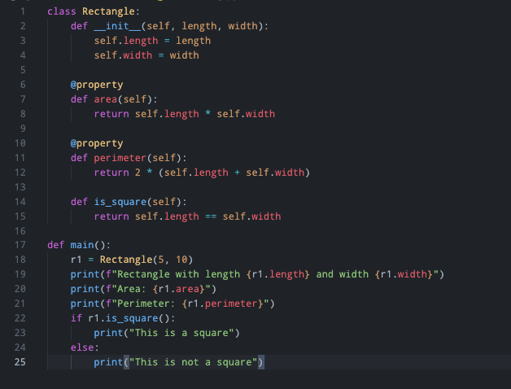

# Github One Dark Color Theme for VSCode

> I rate myself of being quite picky when it comes to code color themes. There were no existing color theme on marketplace that really works 100% to me.

That being said, this color theme is a mix of color configurations of the only two color themes that I feel satisfied with - Github theme and Atom One Dark.

This color theme is not published onto VSCode extension marketplace as apparanetly I am just mix and matching colors.

## Use locally

1. Install `vsce` with `npm install @vscode/vsce`
2. Enable `code` CLI from VSCdoe settings: `SHELL Command: Install 'code' command in PATH`

```bash
cd github-one-dark-theme

vsce package
code --install-extension github-one-dark-theme-0.0.1.vsix
```

The theme will be installed on `.vscode/extensions`.

## Sample code

